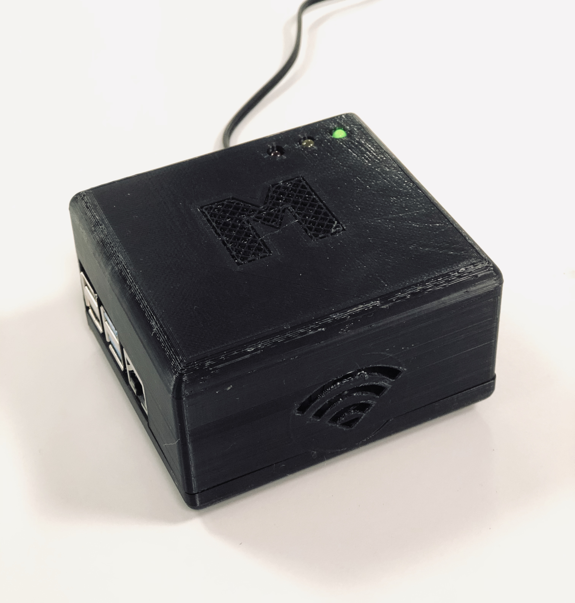

# PROJECT HEA:RT
**Health Evaluation and Awereness using Reliable Technology**



## Intro

This project is a multisensor platform for conducting realtime measurements of wireless sensors placed on a human body.
The measurements are analyzed with a set of algorithms to determine heartrate and arrhythmia. 
The platform has support for sending the data to a mobile application and in the future to a database.

## Getting Started

### Requirements

* Development: Windows or Linux (limited support for gRPC and Xamarin) 
* Runtime: Windows or Linux
* .NET Core (tested verison: 3.0)

### Sensors

The platform supports sensors from [Shimmer](http://shimmersensing.com/).
Documentation about the shimmerAPI can be found on their [Github repository](https://github.com/ShimmerEngineering/Shimmer-C-API).

#### Implemented Shimmer Sensors

* [Shimmer3 ECG Unit](http://shimmersensing.com/products/shimmer3-ecg-sensor)
* [Shimmer3 GSR+ Unit](http://shimmersensing.com/products/shimmer3-wireless-gsr-sensor)

### For Linux

The following command line commands are only performed once for each added device:

```bash
sudo apt-get install bluez
bluetoothctl
agent on
scan on
scan off #when device is found turn off scan
pair {macaddr} #mac address of found device
trust {macaddr} #mac address of found device
ctrl-c #exit bluetootctl
```

Create an sh file for the first device:

```bash
#!/bin/bash
rfcomm connect hci0 {macaddr} #Connect to rfcomm0
```

Create sh files for all following devices (And increase channel number for each device)

```bash
#!/bin/bash
rfcomm connect 1 {macaddr} #Connect to rfcomm1
```

Open crontab: `sudo crontab -e` and insert the following lines at the end of the document:

```bash
#Bluetooth demon takes approx 20 seconds to start
@reboot sleep 30 && /usr/bin/sudo {Path_to_device_1_sh_file}
#Await first connect before connecting second device
@reboot sleep 40 && /usr/bin/sudo {Path_to_device_2_sh_file}
#Increase sleep for each added device
```

### Windows and Linux

```bash
git clone https://github.com/emiilbjorklund/hea_rt.git
cd Basestation
etc etc etc
```
